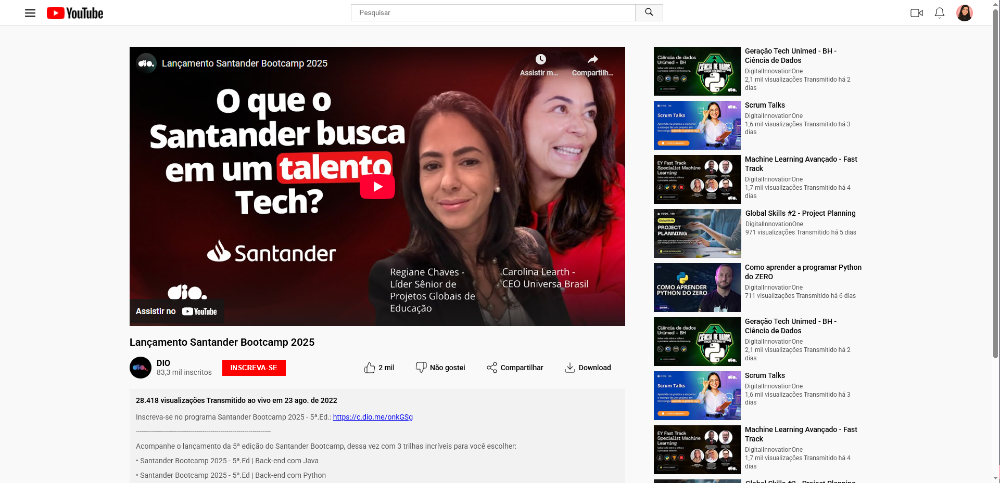

# 📺 Clone da Interface do YouTube  

Este projeto é um desafio da **Digital Innovation One (DIO)** para clonar a interface principal de um vídeo do YouTube, focando no layout e na estilização utilizando **HTML** e **CSS**.  

O objetivo foi replicar a estrutura de uma página de vídeo, incluindo:  
- Barra de navegação superior  
- Player do vídeo  
- Seção de informações e ações (curtir, compartilhar, etc.)  
- Descrição do vídeo  
- Barra lateral com sugestões  

---

## 🚀 Tecnologias Utilizadas  
- **HTML5**: Para estruturar a página e seus elementos.  
- **CSS3**: Para estilizar o layout, utilizando **Flexbox** para alinhar e distribuir os elementos de forma responsiva e eficiente.  
- **SVG**: Para ícones vetoriais.  

---

## ✨ Funcionalidades  
- **Layout Baseado em Flexbox**: Utiliza `display: flex` para alinhar os elementos da barra de navegação e as seções principais da página.  
- **Estrutura Centralizada**: O conteúdo principal (vídeo e barra lateral) é centralizado na página, replicando a experiência de visualização do YouTube.  
- **Área de Ações Interativa**: Botões de curtir, não curtir, compartilhar e download, estilizados para se assemelharem à interface original.  
- **Barra Lateral de Sugestões**: Uma lista de vídeos sugeridos, alinhada com o conteúdo principal.  

---

## 🎨 Layout  
O design do projeto é baseado nesta referência da interface do YouTube:  

- 

---

Desenvolvido com ❤️ por <strong>July Ribeiro</strong> para o Desafio de Projeto da DIO.
